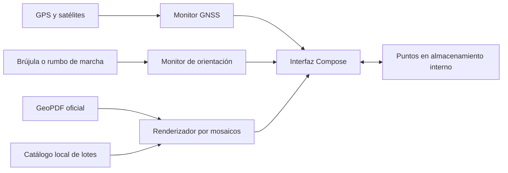

# GeoLuker

<p align="center">
  
</p>

<p align="center">
  <strong>Orientación precisa y consulta del mapa oficial de la plantación, incluso sin internet.</strong>
</p>

<p align="center">
  
  
  
  
</p>

GeoLuker es una aplicación Android privada creada para que el personal de Luker Agrícola pueda ubicarse, consultar lotes y registrar puntos directamente sobre el mapa oficial de la plantación. No utiliza cuentas, servidores ni servicios cartográficos externos.

## Qué ofrece

- Mapa oficial GeoPDF incluido dentro de la aplicación: no se descarga ni se importa.
- Posición GNSS en tiempo real con círculo de precisión y conteo de satélites.
- Brújula real en dispositivos compatibles y rumbo de desplazamiento GPS en equipos sin magnetómetro.
- Gestos de zoom, desplazamiento y rotación con límites de cámara y centrados animados.
- Renderizado progresivo por mosaicos de hasta 16 384 px, solapamiento para evitar textos cortados y caché de memoria limitada.
- Seguimiento GPS continuo con modo norte arriba, brújula o rumbo de desplazamiento.
- Centrado automático al obtener una posición válida dentro de la plantación.
- Aviso claro cuando la ubicación está fuera de Luker Agrícola.
- Búsqueda local de 177 lotes por código, sin conexión.
- Creación de puntos mediante pulsación prolongada sobre el mapa.
- Búsqueda, orden por cercanía/nombre/fecha, edición, eliminación y localización de puntos.
- Etiquetas visibles sobre el mapa y protección frente a puntos duplicados accidentales.
- Interfaz Material 3 adaptada a los colores oficiales de Luker Agrícola.

## Orientación adaptable al teléfono

GeoLuker valida las lecturas del sensor antes de mostrar una dirección. Así evita que ciertos teléfonos presenten una flecha inmóvil aunque Android anuncie una brújula virtual defectuosa.

| Capacidad del dispositivo | Comportamiento |
|---|---|
| Magnetómetro o vector de rotación válido | La flecha azul indica hacia dónde apunta el teléfono y aplica corrección de declinación magnética. |
| Sin brújula física | La interfaz muestra **Rumbo al caminar** mientras el usuario está quieto. |
| Movimiento GPS desde 0,8 m/s | La flecha dorada indica la dirección real del desplazamiento y la interfaz muestra **Rumbo GPS**. |
| Pérdida del rumbo durante el seguimiento | El mapa regresa suavemente a norte arriba en lugar de conservar una orientación antigua. |

La dirección calculada por GPS representa hacia dónde se mueve la persona; no puede indicar hacia dónde apunta un teléfono inmóvil que carece de magnetómetro.

## Privacidad y funcionamiento offline

GeoLuker no requiere cuenta, backend ni conexión de red. El manifiesto no solicita permisos de internet. El mapa, el catálogo de lotes y los recursos visuales vienen dentro del APK; la ubicación y los puntos permanecen únicamente en el almacenamiento interno de la aplicación.

La única autorización solicitada durante el uso es la ubicación precisa de Android. El GPS funciona sin datos móviles, aunque una conexión temporal puede acelerar la primera adquisición de satélites después de estrenar o reiniciar el teléfono. Al desinstalar la aplicación también se eliminan los puntos guardados localmente.

## Tecnología

- Kotlin y Jetpack Compose
- Material 3
- `PdfRenderer` para visualizar el mapa oficial a alta resolución
- PDFBox para leer la georreferenciación interna del GeoPDF
- APIs GNSS y sensores de orientación de Android
- Preferencias privadas de Android para persistir puntos



## Datos técnicos

| Propiedad | Valor |
|---|---|
| Identificador | `co.geoluker.app` |
| Versión actual | `0.1.0` (`versionCode 1`) |
| Android mínimo | Android 10 — API 29 |
| SDK de compilación y destino | API 35 |
| Java/Kotlin JVM | 17 |
| Mapa incluido | `app/src/main/res/raw/luker_map.pdf` |
| Catálogo local | 177 lotes indexados |
| Permisos | Ubicación aproximada y precisa |
| Acceso a internet | No solicitado |

## Requisitos de desarrollo

- Android Studio con el JDK integrado o JDK 17 compatible.
- Android SDK 35 instalado.
- Dispositivo con Android 10 o posterior.
- GPS recomendado para la operación en campo; el magnetómetro es opcional.

## Abrir y verificar en Android Studio

1. Abre esta carpeta como proyecto, no solamente la carpeta `app`.
2. Espera a que termine **Gradle Sync**.
3. Conecta el teléfono con depuración USB o crea un emulador con Android 10+.
4. Ejecuta la configuración `app`.
5. Concede ubicación precisa cuando GeoLuker la solicite.
6. Realiza la primera prueba GPS al aire libre y con la pantalla encendida.
7. Prueba nuevamente con modo avión para comprobar el funcionamiento offline.

Desde una terminal PowerShell ubicada en la raíz también puedes verificar el código:

```powershell
.\gradlew.bat compileDebugKotlin
.\gradlew.bat testDebugUnitTest
.\gradlew.bat lintDebug
```

Estos comandos no generan el APK. La verificación actual completa **23 pruebas unitarias** y Android Lint sin errores. Consulta [la guía de Android Studio](docs/android-studio-pasos.md) para crear y firmar una nueva versión.

## Actualizar el mapa oficial

Las actualizaciones se distribuyen mediante una nueva versión del APK:

1. Sustituye `app/src/main/res/raw/luker_map.pdf` por el nuevo GeoPDF oficial de una sola página.
2. Conserva la georreferenciación interna del documento.
3. Regenera el catálogo de búsqueda:

```powershell
python tools/generate_lot_catalog.py app/src/main/res/raw/luker_map.pdf app/src/main/assets/lots.json
```

4. Revisa el número de lotes informado por el script.
5. Ejecuta las pruebas y compila la nueva versión firmada del APK.

El generador reconoce las familias de códigos presentes en el mapa actual. Si el esquema de nombres cambia, actualiza primero sus rangos en `tools/generate_lot_catalog.py`.

## Estructura principal

```text
app/src/main/
├── assets/lots.json                 # Índice local de búsqueda
├── java/co/geoluker/app/
│   ├── location/                    # GNSS, satélites y calidad
│   ├── map/                         # GeoPDF y catálogo de lotes
│   ├── orientation/                 # Brújula, validación y rumbo GPS
│   ├── points/                      # Puntos locales
│   └── ui/                          # Pantallas y tema visual
└── res/
    ├── drawable-nodpi/              # Logo oficial
    └── raw/luker_map.pdf            # Mapa oficial integrado
```

## Documentación

- [Guía para abrir, ejecutar y firmar el proyecto](docs/android-studio-pasos.md)
- [Especificación funcional y requerimientos](docs/especificacion-requisitos-geoluker.md)

## Alcance de precisión

El punto azul representa la lectura y el círculo de precisión entregados por Android. GeoLuker mejora su representación y descarta estados engañosos, pero no puede superar físicamente la precisión del receptor del teléfono. La cantidad de satélites, el follaje, los edificios, el clima y el modelo del dispositivo pueden afectar el resultado.

La aplicación está pensada para orientación operativa dentro de la plantación. No reemplaza un levantamiento topográfico ni debe utilizarse para decisiones legales de linderos.

## Distribución

Proyecto privado. El propietario genera, firma y distribuye cada APK directamente. Antes de instalar GeoLuker junto a la aplicación anterior, ten presente que `co.geoluker.app` es un identificador nuevo: Android las considera aplicaciones diferentes y no migra automáticamente los datos guardados por la versión antigua.
