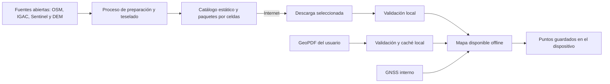

# Georefer - Especificación de requisitos del MVP

**Versión:** 0.2  
**Fecha:** 5 de agosto de 2026  
**Estado:** Borrador para validación  
**Plataforma:** Android, distribución mediante APK privado

## 1. Visión del producto

Georefer será una aplicación Android para técnicos de campo y agricultores que necesiten ubicarse sobre cartografía rural sin depender de conectividad. El usuario podrá descargar mapas gratuitos por municipio o por un área dibujada, importar un GeoPDF desde el almacenamiento del dispositivo, visualizar su posición GNSS en tiempo real y guardar puntos seleccionados manualmente sobre el mapa.

La aplicación priorizará tres cualidades:

1. Funcionamiento confiable en áreas rurales sin cobertura de datos.
2. Manejo sencillo de cartografía georreferenciada.
3. Interfaz profesional con la identidad visual **Bosque andino**.

## 2. Usuarios objetivo

- Técnicos de campo.
- Agricultores.
- Usuarios con teléfonos Android de gama alta.
- Dispositivo principal de prueba: POCO X8 Pro Max.
- Personas que pueden trabajar durante periodos prolongados sin internet.

## 3. Alcance acordado del MVP

### Incluido

- APK privado para Android.
- Compilación, firma y distribución del APK administradas directamente por el propietario del proyecto.
- Interfaz en español.
- Sin registro ni inicio de sesión.
- Sin mapas precargados.
- Catálogo de mapas descargables cuando exista conexión.
- Descarga por departamento y municipio.
- Descarga de un área más pequeña dibujada por el usuario.
- Vistas rural, topográfica, relieve, satélite gratuita e híbrida.
- Funcionamiento offline de los mapas ya descargados.
- Importación local de GeoPDF georreferenciado.
- Posición GNSS del teléfono en tiempo real.
- Modos norte arriba y orientación según el teléfono.
- Visualización elegante de coordenadas y precisión estimada.
- Selección manual de puntos mediante pulsación prolongada.
- Guardado local de nombre, nota, fecha y coordenadas del punto.
- Edición y eliminación local de puntos.
- Control de transparencia del GeoPDF.
- Avisos de nuevas versiones de mapas al recuperar conexión.
- Administración dinámica del almacenamiento, sin reservar una cuota fija.
- Fuentes de datos cartográficos gratuitas y con atribución correspondiente.

### Fuera del MVP

- iOS, web o escritorio.
- Inicio de sesión y perfiles de usuario.
- Sincronización de puntos con servidores.
- Registro de recorridos o navegación paso a paso.
- Fotografías en los puntos.
- Categorías de puntos.
- Exportación de puntos.
- Receptores GNSS externos por Bluetooth.
- Herramienta para georreferenciar PDF comunes.
- Mapas de Google almacenados offline.
- Precisión o certificación topográfica.

## 4. Fuentes y vistas cartográficas

| Vista | Contenido | Fuente prevista | Limitación principal |
|---|---|---|---|
| Rural | Caminos, senderos, ríos, poblaciones y nombres | Datos de OpenStreetMap procesados en paquetes propios | La cobertura rural depende de las contribuciones disponibles |
| Topográfica | Vista rural, curvas de nivel y cotas | IGAC y modelos digitales de elevación abiertos | El detalle varía según la fuente |
| Relieve | Sombreado y elevación del terreno | IGAC, NASADEM o SRTM | Resolución general aproximada de 30 m |
| Satélite gratuita | Cobertura del terreno | Ortoimágenes del IGAC y Sentinel-2 | Sentinel-2 tiene resolución aproximada de 10 m |
| Híbrida | Satélite con caminos, nombres y límites | Combinación de las anteriores | Mayor tamaño de descarga |
| GeoPDF | Mapa técnico proporcionado por el usuario | Archivo local | Solo se aceptan archivos con georreferenciación válida |

Los datos de OpenStreetMap pueden reutilizarse bajo ODbL con atribución, pero no se utilizará `tile.openstreetmap.org` para descargas masivas. Los paquetes offline deberán generarse desde los datos o desde una infraestructura autorizada.

## 5. Requisitos funcionales

### 5.1 Inicio y navegación

- **RF-001:** Al instalarse, la aplicación no incluirá mapas de Colombia.
- **RF-002:** Si no existen mapas locales, la pantalla principal mostrará las acciones `Descargar mapa` e `Importar GeoPDF`.
- **RF-003:** La navegación principal tendrá las secciones Mapa, Descargas, Puntos y Ajustes.
- **RF-004:** La aplicación recordará el último mapa y la última posición de cámara utilizados.

### 5.2 Catálogo y descarga de mapas

- **RF-010:** Con internet, el usuario podrá consultar el catálogo de zonas disponibles.
- **RF-011:** El usuario podrá elegir `Departamento > Municipio`.
- **RF-012:** El usuario podrá dibujar un rectángulo para descargar un área personalizada.
- **RF-013:** Para cada área podrá seleccionar una o varias vistas cartográficas.
- **RF-014:** Antes de iniciar, la aplicación mostrará tamaño estimado, cobertura, fecha, fuente y nivel de detalle.
- **RF-015:** La descarga no comenzará si el espacio disponible es insuficiente.
- **RF-016:** La descarga mostrará progreso, tamaño descargado, pausa, reanudación y cancelación.
- **RF-017:** Una descarga interrumpida deberá poder continuar sin reiniciarse desde cero cuando la fuente lo permita.
- **RF-018:** Cada paquete deberá validarse mediante tamaño y suma de comprobación antes de quedar disponible.
- **RF-019:** El usuario podrá eliminar individualmente mapas y archivos temporales.
- **RF-020:** La aplicación no reservará una cantidad fija de almacenamiento.
- **RF-021:** Al recuperar conexión, la aplicación consultará versiones nuevas y mostrará un aviso no intrusivo.
- **RF-022:** Las actualizaciones de mapas requerirán confirmación; no se descargarán automáticamente.
- **RF-023:** Las atribuciones y licencias permanecerán consultables offline.

### 5.3 Uso offline

- **RF-030:** Un mapa descargado deberá abrir, desplazarse y cambiar de escala sin conexión.
- **RF-031:** Las coordenadas, la posición GNSS y los puntos locales seguirán funcionando sin internet.
- **RF-032:** La interfaz deberá diferenciar claramente entre contenido disponible y acciones que requieren conexión.
- **RF-033:** Cerrar o reiniciar la aplicación no deberá afectar los mapas descargados ni los puntos guardados.

### 5.4 Importación de GeoPDF

- **RF-040:** El usuario podrá seleccionar un archivo mediante el selector seguro de documentos de Android.
- **RF-041:** La aplicación aceptará únicamente PDF con información geoespacial interna válida.
- **RF-042:** Se validarán, como mínimo, el área geográfica, los puntos de control y el sistema de referencia.
- **RF-042A:** El MVP admitirá GeoPDF de una sola página y tamaño máximo de 250 MB.
- **RF-043:** Un PDF sin georreferenciación, cifrado, corrupto o incompatible mostrará una explicación clara y no se importará parcialmente.
- **RF-044:** La aplicación deberá reconocer como mínimo WGS 84, MAGNA-SIRGAS/Colombia Bogotá zone (EPSG:3116) y MAGNA-SIRGAS/Origen-Nacional (EPSG:9377).
- **RF-045:** Las coordenadas deberán transformarse al sistema de visualización sin modificar la definición original del archivo.
- **RF-046:** El GeoPDF podrá mostrarse solo o encima de un mapa base compatible.
- **RF-047:** El usuario podrá ajustar su transparencia entre 0 % y 100 %.
- **RF-048:** Si la ubicación está fuera de la cobertura del GeoPDF, la aplicación indicará la distancia aproximada hasta el área.
- **RF-049:** La aplicación conservará el archivo original y administrará por separado la caché generada para visualizarlo.
- **RF-050:** El usuario podrá eliminar el mapa importado y su caché desde Mis mapas.

### 5.5 Posición GNSS

- **RF-060:** La aplicación utilizará exclusivamente los sensores internos del teléfono durante el MVP.
- **RF-061:** Solicitará permiso de ubicación precisa únicamente cuando sea necesario y explicará su uso.
- **RF-062:** Mostrará un punto GPS azul, círculo de incertidumbre y, cuando esté disponible, dirección del movimiento.
- **RF-063:** El punto GPS no será un marcador persistente.
- **RF-064:** La aplicación mostrará la precisión horizontal informada por Android y el estado `Buscando`, `Baja`, `Aceptable` o `Buena`.
- **RF-064A:** El estado será `Buscando` sin lectura o después de 10 segundos; `Baja` con precisión mayor de 15 m; `Aceptable` entre más de 5 m y 15 m; y `Buena` hasta 5 m.
- **RF-064B:** Para evitar parpadeos, mejorar de estado requerirá dos lecturas consecutivas y degradar será inmediato.
- **RF-065:** No se presentará una precisión ficticia cuando Android no entregue una estimación confiable.
- **RF-066:** Se descartarán lecturas obsoletas y saltos claramente anómalos.
- **RF-067:** El usuario podrá centrar el mapa en su posición mediante un botón flotante.
- **RF-068:** El usuario podrá cambiar entre norte arriba y orientación según el teléfono.
- **RF-069:** La aplicación avisará cuando el GPS esté desactivado.
- **RF-070:** La pérdida temporal de señal conservará la última ubicación con una indicación visual de que está desactualizada.

### 5.6 Coordenadas

- **RF-080:** Una tarjeta compacta mostrará coordenadas y precisión sin cubrir innecesariamente el mapa.
- **RF-081:** El usuario podrá alternar entre grados decimales, grados/minutos/segundos y el sistema del mapa activo.
- **RF-082:** Cuando corresponda, estará disponible MAGNA-SIRGAS/Origen-Nacional EPSG:9377.
- **RF-083:** El usuario podrá copiar las coordenadas al portapapeles.
- **RF-084:** Siempre se mostrará el nombre o código del sistema de referencia para evitar ambigüedad.

### 5.7 Puntos manuales

- **RF-090:** Una pulsación prolongada colocará un marcador provisional naranja.
- **RF-091:** El marcador provisional podrá ajustarse antes de guardarlo.
- **RF-092:** El usuario podrá cancelar la selección sin crear datos.
- **RF-093:** Para guardar se solicitará un nombre; la nota será opcional.
- **RF-094:** Se almacenarán identificador, nombre, nota, latitud, longitud, fecha de creación y fecha de modificación.
- **RF-095:** Un punto guardado se visualizará en verde oscuro y sin la animación del GPS.
- **RF-096:** El usuario podrá consultar, editar y eliminar puntos.
- **RF-097:** Los puntos permanecerán exclusivamente en el dispositivo.
- **RF-098:** La pantalla deberá aclarar que la precisión GNSS no aplica a un punto colocado manualmente sobre el mapa.

### 5.8 Gestión de mapas

- **RF-100:** Mis mapas separará paquetes descargados, GeoPDF importados y cachés.
- **RF-101:** Cada elemento mostrará nombre, área, vista, tamaño, fecha y estado de actualización.
- **RF-102:** El usuario podrá activar, ocultar, reordenar y eliminar capas compatibles.
- **RF-103:** Antes de eliminar se mostrará el espacio que será liberado.
- **RF-104:** La aplicación advertirá si se intenta eliminar el mapa actualmente visible.

## 6. Requisitos no funcionales

### 6.1 Operación y rendimiento

- **RNF-001:** El mapa local deberá comenzar a mostrarse en menos de 3 segundos en el dispositivo objetivo, salvo que se esté procesando un GeoPDF por primera vez.
- **RNF-002:** El desplazamiento y zoom deberán mantenerse visualmente fluidos en teléfonos Android de gama alta.
- **RNF-003:** La interfaz nunca deberá bloquearse mientras se importa, valida o descarga un mapa.
- **RNF-004:** Las tareas largas deberán mostrar progreso y permitir cancelación segura.
- **RNF-005:** La aplicación deberá funcionar correctamente después de un reinicio del teléfono.

### 6.2 Confiabilidad de datos

- **RNF-010:** Los archivos se escribirán primero como temporales y solo se activarán después de validarse.
- **RNF-011:** Una descarga incompleta no deberá aparecer como un mapa listo.
- **RNF-012:** Los puntos se almacenarán mediante transacciones locales para reducir riesgo de pérdida.
- **RNF-013:** Una actualización de mapa fallida conservará la versión anterior utilizable.

### 6.3 Privacidad y seguridad

- **RNF-020:** No se requerirá cuenta ni identificador personal.
- **RNF-021:** La ubicación y los puntos no se enviarán a ningún servidor.
- **RNF-022:** La aplicación solicitará únicamente ubicación precisa y acceso a archivos mediante el selector de Android.
- **RNF-023:** El APK deberá estar firmado y tener control de versión.
- **RNF-024:** Las conexiones al catálogo y descargas deberán usar HTTPS.

### 6.4 Batería

- **RNF-030:** La frecuencia GNSS será configurable internamente según si el mapa está visible o la aplicación está en segundo plano.
- **RNF-031:** No se mantendrá el GNSS activo en segundo plano en el MVP.
- **RNF-032:** La aplicación informará si el modo de ahorro de energía reduce la precisión.

### 6.5 Accesibilidad y diseño

- **RNF-040:** La identidad visual será Bosque andino.
- **RNF-041:** El GPS azul, el marcador provisional naranja y los puntos guardados verdes se diferenciarán también por forma y animación, no solo por color.
- **RNF-042:** Los controles principales tendrán áreas táctiles adecuadas para uso en campo.
- **RNF-043:** La información esencial tendrá contraste legible bajo luz exterior.
- **RNF-044:** Los mensajes evitarán terminología GIS innecesaria y ofrecerán detalles técnicos bajo demanda.
- **RNF-045:** Se respetará el tamaño de texto configurado en Android sin recortes críticos.

### 6.6 Compatibilidad

- **RNF-050:** La orientación objetivo será vertical, con soporte funcional para horizontal donde el mapa lo requiera.
- **RNF-051:** La aplicación deberá operar sin Google Maps.
- **RNF-052:** La arquitectura no dependerá de una sesión iniciada ni de servicios de sincronización.
- **RNF-053:** El POCO X8 Pro Max será el dispositivo principal de rendimiento y prueba de campo.
- **RNF-054:** Las pruebas GNSS aprovecharán y evaluarán su recepción multifrecuencia GPS L1+L5 y las demás constelaciones disponibles, sin asumir que todos los teléfonos futuros tendrán el mismo desempeño.

## 7. Precisión y uso responsable

La aplicación buscará la mejor precisión posible con el hardware interno mediante:

- Solicitud de ubicación precisa.
- Uso de GNSS y estado de satélites disponible en Android.
- Rechazo de posiciones antiguas o claramente anómalas.
- Suavizado visual moderado sin ocultar la precisión real.
- Diferenciación entre ubicación actual, última ubicación conocida y señal perdida.
- Presentación del valor de incertidumbre comunicado por el sistema.
- Pruebas de campo en cielo abierto, vegetación, ladera y proximidad a construcciones.

La aplicación no deberá afirmar que una posición es topográfica. La precisión real depende del teléfono, constelaciones soportadas, obstrucciones, vegetación, relieve, clima espacial y tiempo de adquisición. Para deslindes, replanteos o decisiones legales se requiere equipo y procedimiento topográfico apropiado.

## 8. Arquitectura técnica propuesta

### Aplicación Android

- **Lenguaje:** Kotlin.
- **Interfaz:** Jetpack Compose con componentes Material 3 personalizados según Bosque andino.
- **Motor cartográfico:** MapLibre Native para Android.
- **Ubicación:** APIs GNSS y Location de Android; sin receptor externo en el MVP.
- **Base local:** Room/SQLite para puntos, catálogo local, descargas y configuraciones.
- **Preferencias:** DataStore.
- **Trabajo diferido:** WorkManager para descargas y comprobación de actualizaciones.
- **Selección de archivos:** Storage Access Framework.
- **Formatos offline principales:** MBTiles o un contenedor equivalente validado durante el prototipo técnico.
- **Transformación de coordenadas:** biblioteca basada en PROJ o implementación compatible probada con los CRS admitidos.

### Catálogo estático sin servidor de pago

El proyecto operará sin costos recurrentes y sin un backend dinámico. La propuesta inicial es:

- Catálogo JSON estático publicado en GitHub Pages o en un repositorio público.
- Paquetes de mapas versionados como archivos de GitHub Releases.
- Cada archivo será menor de 2 GiB para cumplir el límite por recurso de GitHub Releases.
- Los departamentos se dividirán previamente en celdas o paquetes pequeños por vista.
- Una selección municipal descargará las celdas que cubran el municipio.
- Un rectángulo dibujado descargará únicamente las celdas que lo intersecten.
- La aplicación leerá varios paquetes locales como una sola cobertura, evitando procesamiento en un servidor.
- El catálogo incluirá versiones, tamaños, límites, licencias y sumas de comprobación.
- Las descargas usarán HTTPS y deberán permitir reanudación.

Este esquema no almacenará cuentas, ubicaciones ni puntos. Es gratuito para una etapa piloto según las condiciones actuales de GitHub, pero deberá revisarse si crecen mucho el volumen de archivos o el número de usuarios. Los datos cartográficos seguirán siendo públicos aunque el APK se distribuya de forma privada.

### Flujo de datos

## 9. Modelo de datos inicial

### Punto

| Campo | Tipo | Regla |
|---|---|---|
| id | UUID | Generado localmente |
| nombre | Texto | Obligatorio |
| nota | Texto | Opcional |
| latitud | Decimal | WGS 84 |
| longitud | Decimal | WGS 84 |
| creadoEn | Fecha/hora | Automática |
| actualizadoEn | Fecha/hora | Automática |
| origen | Enum | Manual |
| mapaId | UUID nulo | Relación opcional con el mapa activo |

### Mapa local

| Campo | Tipo | Regla |
|---|---|---|
| id | UUID | Local o proveniente del catálogo |
| nombre | Texto | Obligatorio |
| tipo | Enum | Descargado o GeoPDF |
| vista | Enum | Rural, topográfica, relieve, satélite, híbrida o técnica |
| límites | Geometría | Cobertura geográfica |
| crs | Texto | Sistema de referencia original |
| versión | Texto | Cuando provenga del catálogo |
| tamaño | Entero | Bytes ocupados |
| rutaLocal | URI | Administrada por la aplicación |
| estado | Enum | Descargando, validando, listo, error o desactualizado |

## 10. Flujos principales

### Primera apertura

1. Mostrar identidad Georefer y explicación breve del uso offline.
2. Presentar pantalla sin mapas.
3. Ofrecer `Descargar mapa` e `Importar GeoPDF`.
4. Solicitar ubicación solo al intentar mostrar la posición.

### Descargar por municipio

1. Elegir departamento y municipio.
2. Elegir una o varias vistas.
3. Revisar tamaño, fecha, fuente y almacenamiento disponible.
4. Confirmar descarga.
5. Mostrar progreso y validar el paquete.
6. Abrir el mapa o dejarlo en Mis mapas.

### Descargar un área dibujada

1. Abrir un mapa de referencia de baja resolución disponible durante la conexión.
2. Dibujar o ajustar el rectángulo.
3. Seleccionar vistas y nivel de detalle permitido.
4. Mostrar tamaño estimado.
5. Confirmar y descargar.

### Importar GeoPDF

1. Elegir el archivo desde el almacenamiento.
2. Validar que sea GeoPDF y leer cobertura/CRS.
3. Mostrar nombre, área, sistema de referencia y tamaño de caché estimado.
4. Procesar localmente y mostrar progreso.
5. Abrirlo o combinarlo con otro mapa compatible.

### Guardar punto manual

1. Mantener presionado el mapa.
2. Mostrar marcador naranja provisional y coordenadas.
3. Permitir ajustar, cancelar o guardar.
4. Solicitar nombre y nota opcional.
5. Guardar localmente y mostrar marcador verde.

## 11. Criterios de aceptación del MVP

El MVP podrá considerarse listo cuando:

1. Se instale mediante APK firmado en los dispositivos objetivo.
2. Permita descargar al menos una zona piloto en cada vista acordada.
3. La zona descargada funcione después de activar modo avión y reiniciar la aplicación.
4. Muestre el GNSS interno y la precisión sin utilizar internet.
5. Importe correctamente el GeoPDF de fertilización entregado como caso de prueba.
6. Coloque la posición GPS dentro del GeoPDF con una transformación coherente.
7. Permita cambiar transparencia y combinar el GeoPDF con un mapa compatible.
8. Permita crear, editar y eliminar puntos manuales sin conexión.
9. Recupere una descarga interrumpida sin corromper el mapa anterior.
10. Muestre actualización disponible sin descargarla automáticamente.
11. No transmita ubicación ni puntos a servidores.
12. Supere una prueba de campo rural acordada sin cierres, pérdidas de mapas o datos.

## 12. Estrategia de pruebas

- Pruebas unitarias de transformaciones, validación y modelo de datos.
- Pruebas instrumentadas de permisos, selector de archivos y persistencia.
- Pruebas de descarga interrumpida, poco almacenamiento y archivo corrupto.
- Pruebas con modo avión antes, durante y después de abrir un mapa.
- Comparación del GeoPDF de fertilización contra sus puntos de control.
- Pruebas GNSS en cielo abierto, bajo árboles, ladera y junto a construcciones.
- Pruebas de legibilidad bajo luz solar.
- Pruebas con pérdida de señal y retorno del GPS.
- Pruebas de actualización conservando la versión anterior.

## 13. Riesgos principales

| Riesgo | Impacto | Mitigación |
|---|---|---|
| GeoPDF con estructuras diferentes | Alto | Limitar el MVP, validar temprano varios archivos y documentar compatibilidad |
| Tamaño de mapas satelitales | Alto | Área dibujada, estimación previa, límites de zoom y descargas reanudables |
| Cobertura rural incompleta | Medio | Mostrar fuente/fecha y permitir GeoPDF del usuario |
| Precisión variable del teléfono | Alto | Mostrar incertidumbre real, probar dispositivos y evitar promesas topográficas |
| Costos de distribución | Alto | Separar datos gratuitos de costos de procesamiento, almacenamiento y ancho de banda |
| Cambios de fuentes o licencias | Medio | Catálogo versionado y revisión periódica de atribuciones |
| Daño o pérdida del teléfono | Medio | Informar que los puntos no tienen respaldo en el MVP |

## 14. Etapas de implementación

1. **Prototipo técnico:** motor de mapa local, GNSS y prueba con el GeoPDF entregado.
2. **Núcleo offline:** almacenamiento, catálogo, descarga reanudable y validación.
3. **Experiencia cartográfica:** capas, transparencia, orientación y coordenadas.
4. **Puntos:** creación, edición, eliminación y persistencia.
5. **Diseño Bosque andino:** componentes finales, accesibilidad y estados.
6. **Preparación de datos:** zona piloto y cinco vistas cartográficas.
7. **Pruebas de campo:** precisión, rendimiento, batería y recuperación de errores.
8. **Entrega privada:** el propietario compila, firma y distribuye manualmente cada versión del APK.

## 15. Decisiones cerradas

1. Departamentos piloto: Casanare y Meta.
2. Dispositivo principal: POCO X8 Pro Max.
3. GeoPDF en el MVP: una página y máximo 250 MB.
4. Infraestructura: sin costos recurrentes; catálogo y paquetes estáticos.
5. APK: compilación, firma y distribución realizadas por el propietario.

## 16. Decisiones pendientes para cerrar la versión 1.0 del documento

1. Versión mínima de Android que se soportará.
2. Municipio o área concreta que se probará primero dentro de Casanare.
3. Municipio o área concreta que se probará primero dentro de Meta.
4. Confirmación de edición y eliminación de puntos.
5. Confirmación de modo oscuro y orientación horizontal.

## 17. Referencias técnicas y de datos

- MapLibre Native Android: <https://maplibre.org/maplibre-native/android/api/>
- Datos abiertos geoespaciales IGAC: <https://www.igac.gov.co/datos-abiertos/datos-abiertos-geoespaciales>
- Proyección oficial MAGNA-SIRGAS/Origen-Nacional: <https://origen.igac.gov.co/>
- Licencia de OpenStreetMap: <https://www.openstreetmap.org/copyright>
- Política del servidor público de mosaicos OSM: <https://operations.osmfoundation.org/policies/tiles/>
- Copernicus Data Space: <https://dataspace.copernicus.eu/>
- NASA Earthdata: <https://www.earthdata.nasa.gov/>
- Especificaciones oficiales del POCO X8 Pro Max: <https://www.mi.com/co/product/poco-x8-pro-max/specs/>
- Límites de archivos y ancho de banda de GitHub Releases: <https://docs.github.com/en/repositories/releasing-projects-on-github/about-releases>
